# Entity Frame And Detailed Workflow

This document is an owner-facing overview of the current system. It shows the main business entities, how they connect, who can perform each action, and how work moves through the application from login to project delivery.

## System Context

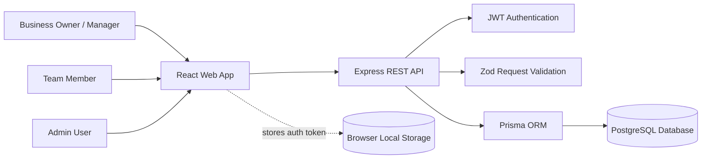

## Detailed Entity Relationship Diagram

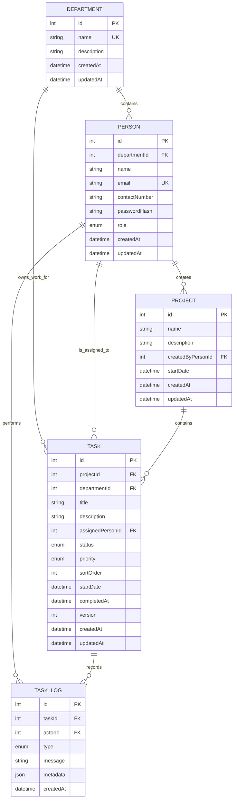

## Entity Meaning

| Entity | Business meaning | Important notes |
| --- | --- | --- |
| `Department` | A business unit or team area. | People can belong to a department; tasks can also be tagged to a department for filtering and reporting. |
| `Person` | A user or team member in the system. | Holds login identity, contact details, role, and optional department. |
| `Project` | A container for work. | Created by one person and contains many tasks. Project status is calculated from its tasks. |
| `Task` | A single piece of project work. | Has status, priority, assignee, department, Kanban order, start/completion dates, and version for conflict protection. |
| `TaskLog` | The activity history of a task. | Records task creation, assignee changes, priority changes, and user notes. |

## Role And Permission Frame

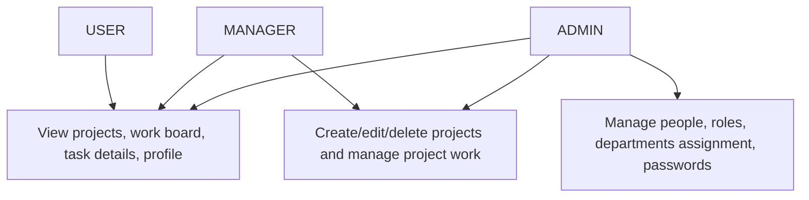

| Area | User | Manager | Admin |
| --- | --- | --- | --- |
| Login/logout | Yes | Yes | Yes |
| View projects | Yes | Yes | Yes |
| View project board | Yes | Yes | Yes |
| Create/edit/delete projects | No | Yes | Yes |
| Create/edit/update tasks | Yes | Yes | Yes |
| Drag and reorder tasks | Yes | Yes | Yes |
| Add task notes | Yes | Yes | Yes |
| View company task report | Yes | Yes | Yes |
| Update own profile/password | Yes | Yes | Yes |
| Create/edit/delete people | No | No | Yes |
| Reset another user's password | No | No | Yes |

## Application Navigation Frame

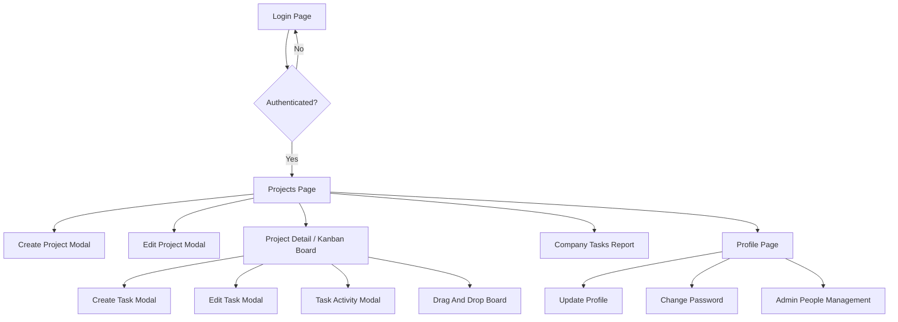

## End-To-End Data Flow

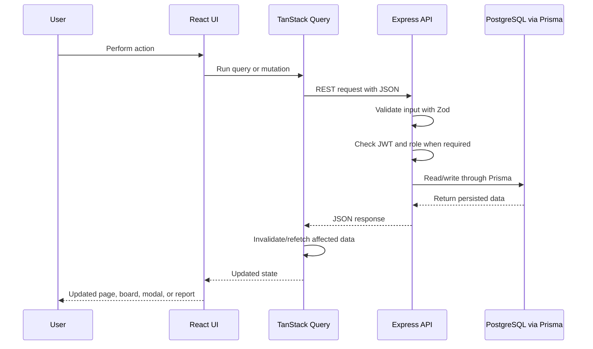

## Authentication Workflow

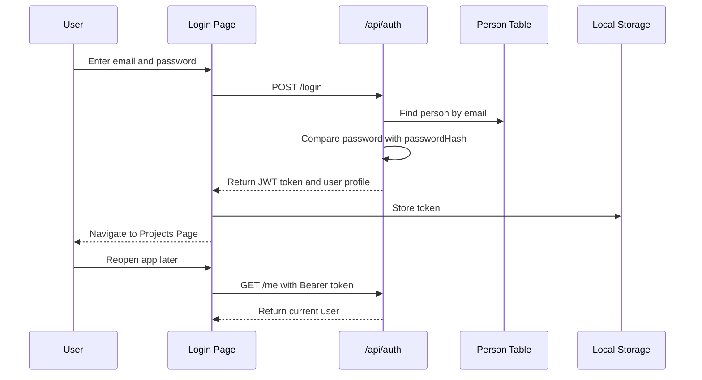

## Project Management Workflow

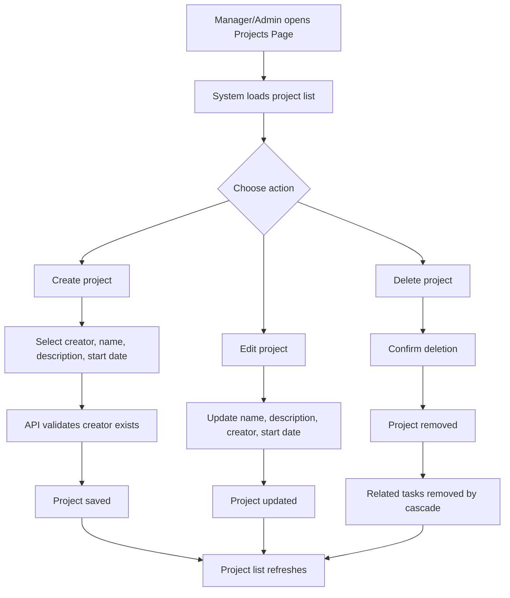

## Task Board Workflow

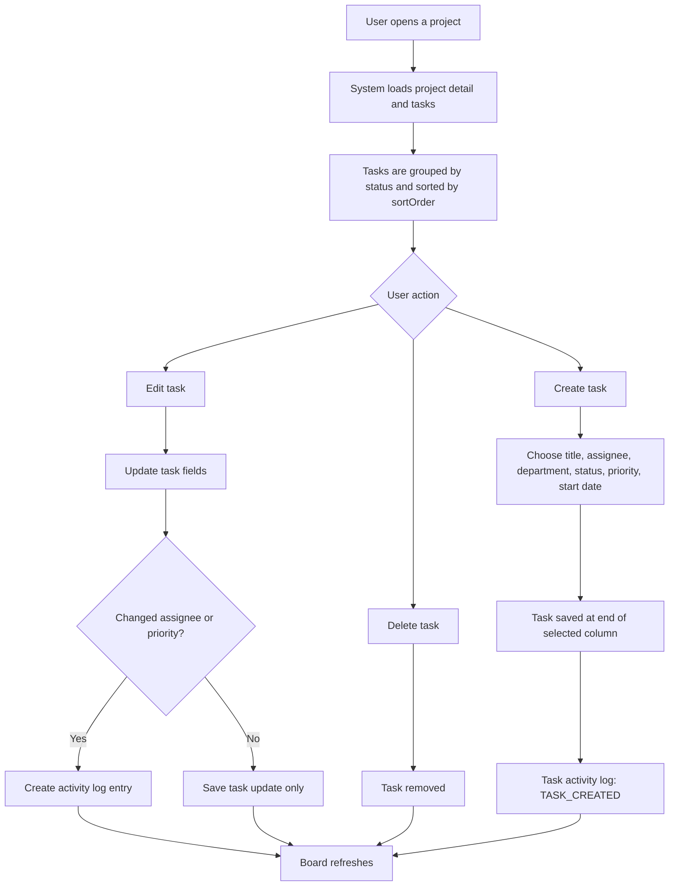

## Kanban Status And Reorder Workflow

Tasks can move freely between columns. The system stores both the workflow status and the card position.

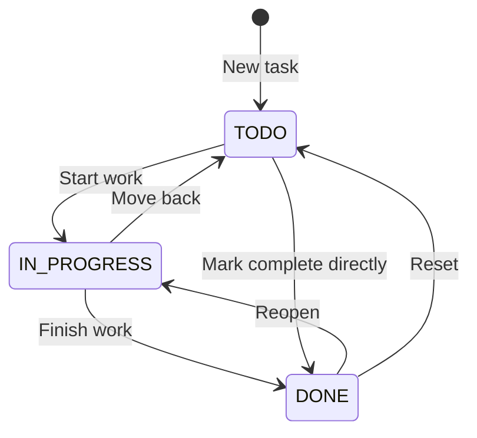

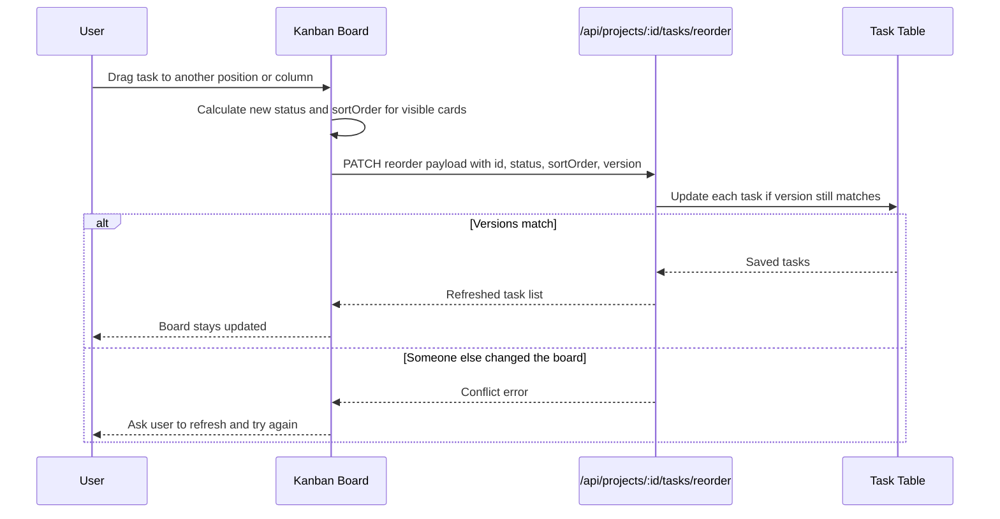

## Task Activity Workflow

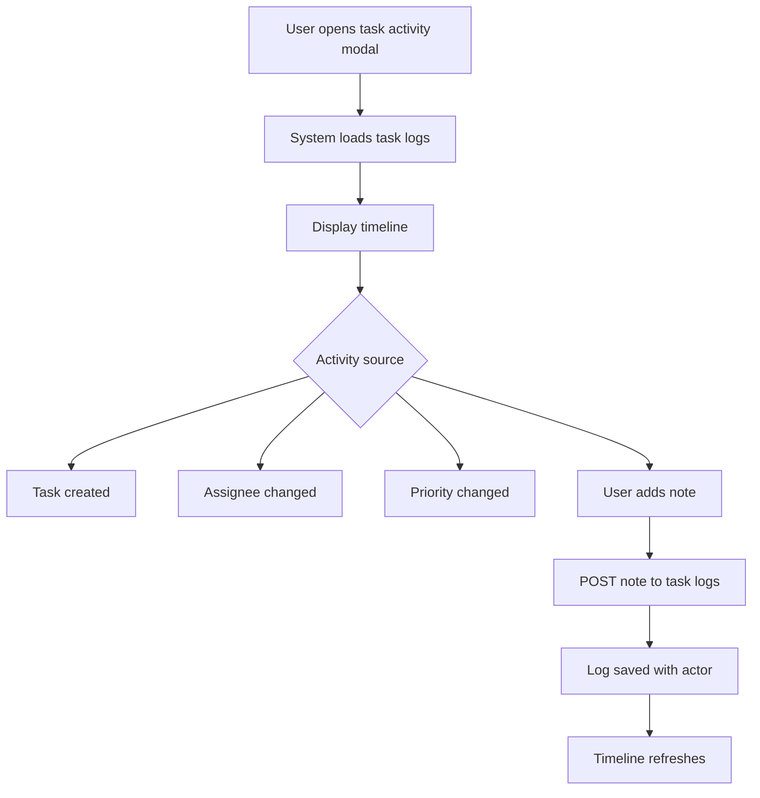

## Company Task Report Workflow

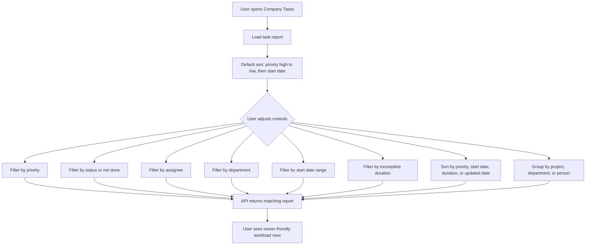

## Admin People Workflow

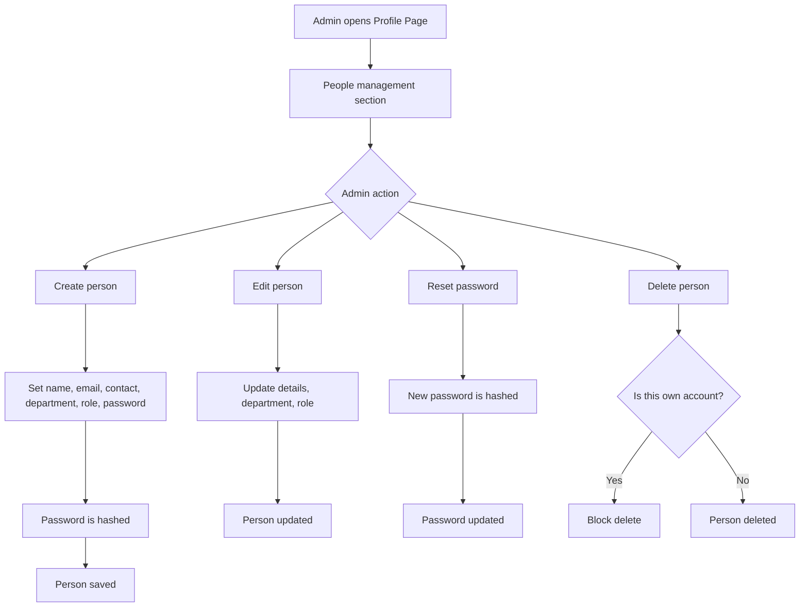

## Project Status Calculation

The project does not need a separate stored status. The UI calculates status from tasks:

| Condition | Owner-facing project status |
| --- | --- |
| Project has no tasks | Empty |
| At least one task is not done | In Progress |
| All tasks are done | Done |

## Task Lifecycle Fields

| Field | Why it matters |
| --- | --- |
| `status` | Places the task in `To Do`, `In Progress`, or `Done`. |
| `priority` | Helps owners see urgent work first. |
| `sortOrder` | Preserves manual card order inside each Kanban column. |
| `startDate` | Supports planning and report filters. |
| `completedAt` | Automatically set when a task reaches `Done`; cleared when reopened. |
| `version` | Prevents one user's stale update from overwriting another user's newer change. |

## Owner Summary

```text
The owner can explain the system as:

1. People belong to departments and have roles.
2. Managers/Admins create projects.
3. Projects contain tasks.
4. Tasks are assigned to people and optionally tagged to departments.
5. Tasks move through To Do, In Progress, and Done.
6. Every important task change can appear in activity history.
7. The report page gives an owner-level view across all company tasks.
```
