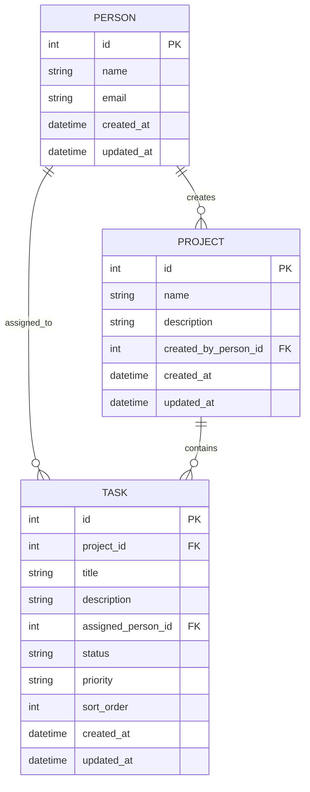
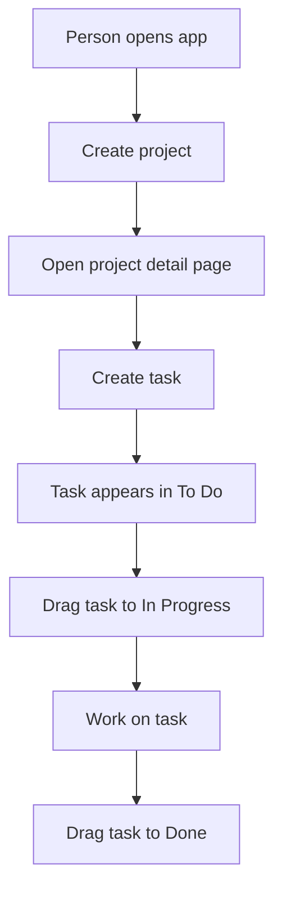
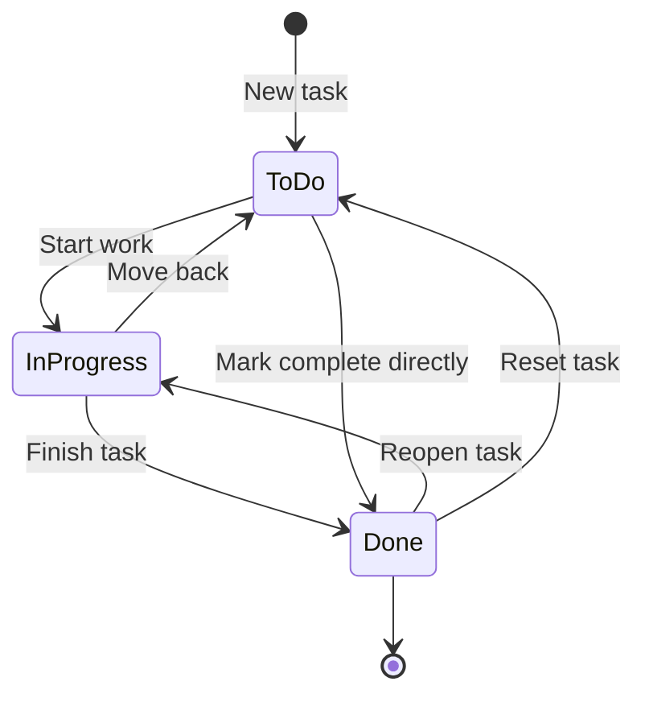

# Entity Diagram And Workflow

## Entity Relationship Diagram



## Simple Entity Explanation

```text
Person
  creates many Projects
  can be assigned many Tasks

Project
  is created by one Person
  contains many Tasks

Task
  belongs to one Project
  can be assigned to one Person
```

## Main Workflow



## Kanban Status Workflow

Tasks can move freely between the three Kanban columns.



## Kanban Board Layout

```text
Project Detail Page

+----------------+----------------+----------------+
| To Do          | In Progress    | Done           |
+----------------+----------------+----------------+
| Task A         | Task C         | Task E         |
| Task B         | Task D         | Task F         |
+----------------+----------------+----------------+
```

## Drag And Drop Data Update

When a task is dragged, the system updates:

```text
task.status
task.sort_order
task.updated_at
```

Example:

```text
Task: Book movers
Old status: To Do
New status: In Progress
New sort order: 2
```

## Project Completion Rule

The MVP does not need a manual project status.

Project status can be calculated:

```text
If project has no tasks:
  Project is empty

If project has at least one task not in Done:
  Project is active

If all project tasks are Done:
  Project is complete
```
